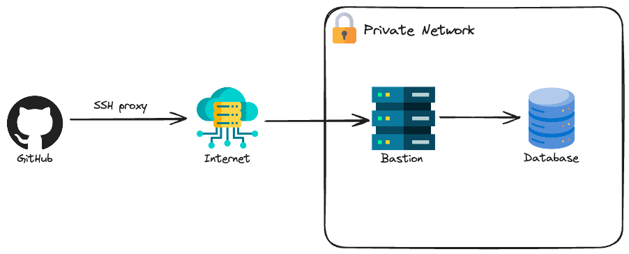
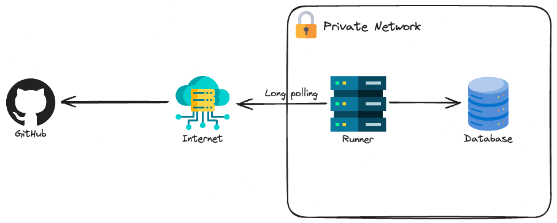

# iac-private-resources

This is a git repository to serve as a demo of my [Using IaC to configure private resources](https://felipetrindade.com/iac-private-resources) blog post. If you want to understand in depth what this is about I highly recommend checking the blog post.

The goal of this project is to present two ways of configuring private resources. First, let's define what I mean by private resources. Private resources are resources that are not accessible directly via the internet, i.e. are resources that are contained in a private network. When I say "resources" I'm talking about terraform resources that provision a configuration for applications/services. A good example is a DB/User in a database (which is typically deployed in a private network and can't be accessed directly), but it could have been a configuration for [Harbor](https://registry.terraform.io/providers/goharbor/harbor/latest), [Keycloak](https://registry.terraform.io/providers/mrparkers/keycloak/latest) or any other service that can be configured. For this demo we want to create a DB in a database service.

For this demo, I will use [Opentofu](https://opentofu.org/): the open-source version of Terraform.

## Demo

There is nothing to do in terms of manual actions since there is a GitHub Actions workflow for creating the resources in [Vultr](https://www.vultr.com/) cloud. You could have use any other cloud for this, I'm using Vultr because it's cheap, easy to use and great for small projects, but I usually use AWS.

Two options will be presented to configure a private resource:
- **SSH-proxy**: A bastion host (public instance that developers have access) to serve as a proxy to access internal/private resources in the cloud network.

- **Self-hosted**: Instead of using the bastion as a proxy, the entire CI/CD can be deployed inside the private network, this is called self-hosted.

